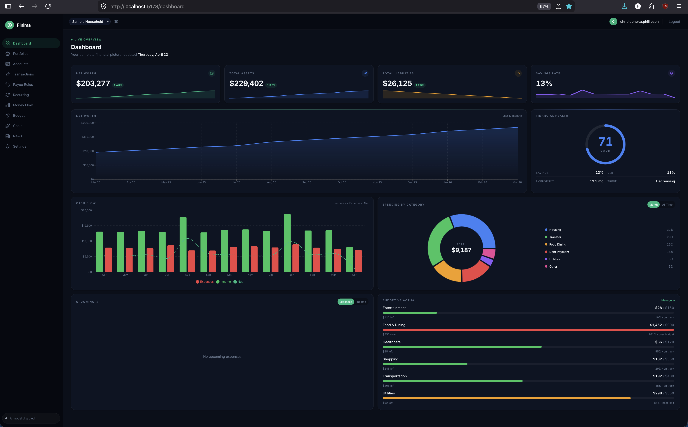
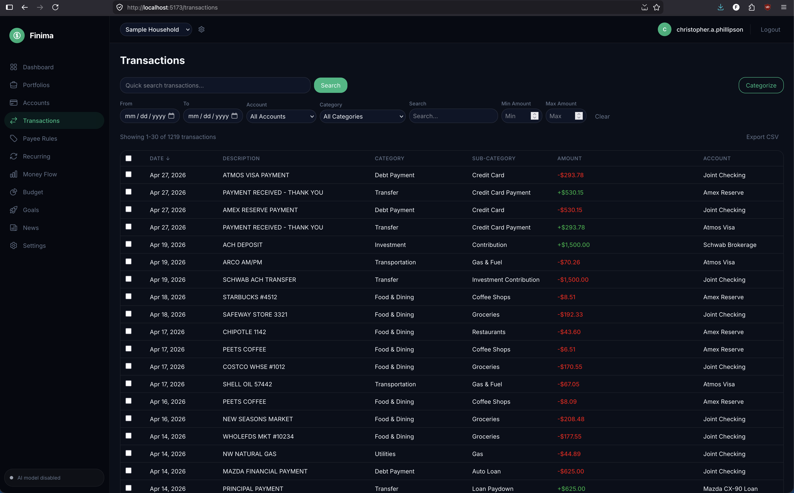
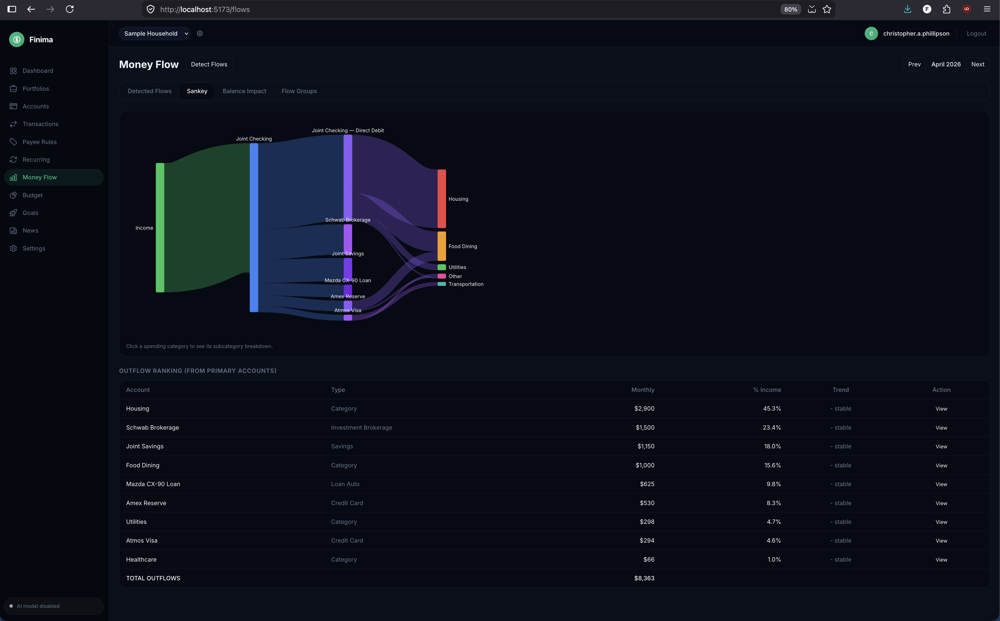
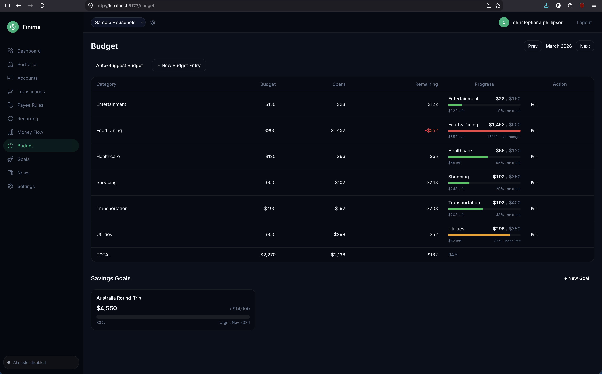
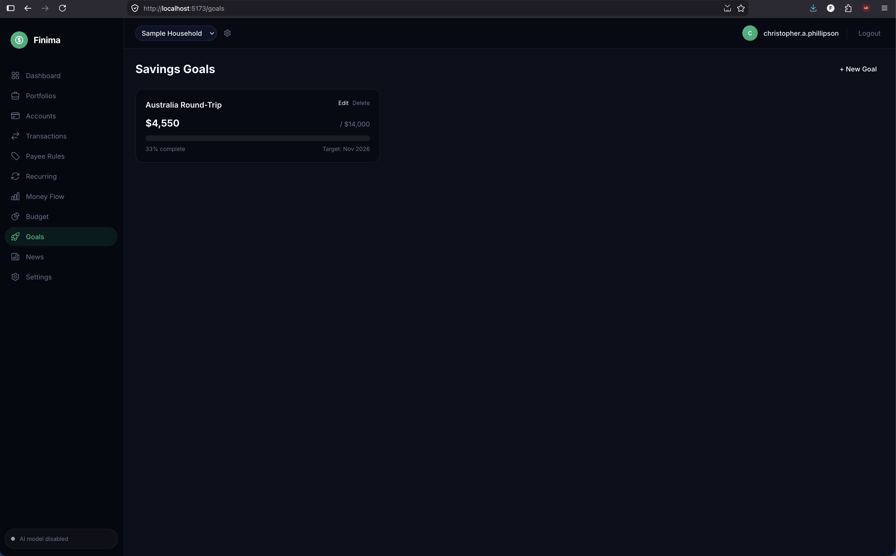
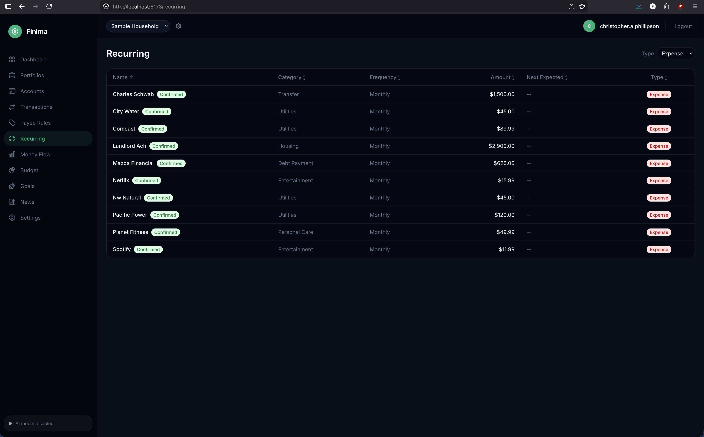
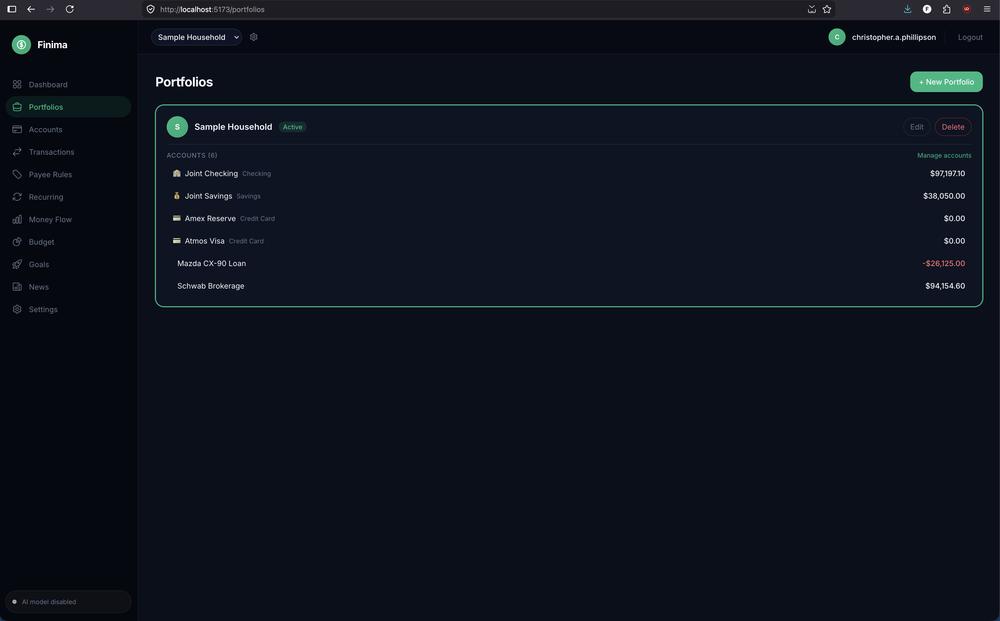
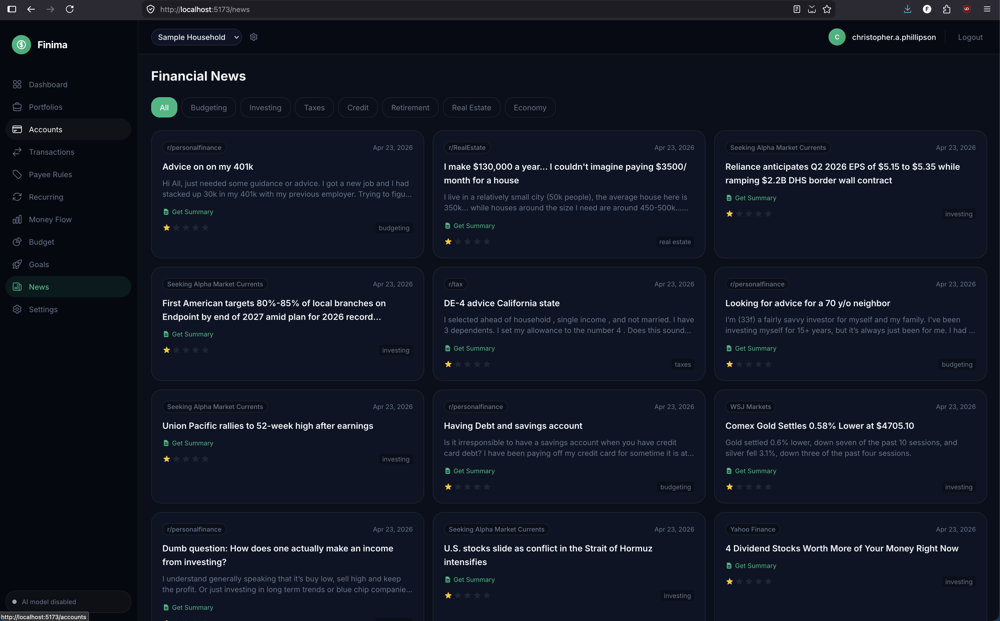

# Finima 💸

**Your finances, finally under your control.**

> _Finance + Intelligence = Finima._ Because understanding your money shouldn't require handing it to someone else.

[](https://github.com/pacphi/finima/actions/workflows/ci.yml)
[](https://github.com/pacphi/finima/actions/workflows/release.yml)
[](https://github.com/pacphi/finima/actions/workflows/check-links.yml)
[](https://github.com/pacphi/finima/releases)
[](https://opensource.org/licenses/MIT)

Finima is a **privacy-first, self-hosted personal finance intelligence platform**. Import transactions from any bank, let a local AI classify and analyze them, and get deep insight into your spending, savings, and cash flow — without your data ever leaving your machine.

🔒 **No cloud sync. No subscriptions. No data brokers.** Just fast, private, intelligent finance.

---

## 💡 Why Finima?

Most finance apps ask you to trust them with your most sensitive data. Finima flips that model entirely. Here's what makes it different:

- 🏠 **100% self-hosted** — your financial data lives on your hardware, under your rules. No SaaS, no terms-of-service surprises.
- 🤖 **Local AI categorization** — an Ollama-powered LLM classifies your transactions on-device. No cloud API calls, ever.
- 📂 **Bank-agnostic import** — bring data from any institution via CSV, OFX, QIF, or XLSX, with a guided column-mapping UI.
- ⚡ **Built for speed** — a Rust backend processes thousands of transactions in milliseconds; the React frontend stays snappy at any scale.
- 🔄 **Learns your patterns** — recurring transaction detection, inter-account flow analysis, and a composite health score that improves as it learns your finances.
- 🔑 **Passwordless by default** — magic-link sign-in means no passwords to forget, reuse, or breach.

---

## 📸 Screenshots

<p align="center">
  
  &nbsp;
  
</p>

<p align="center">
  <em>Dashboard</em>&nbsp;&nbsp;&nbsp;&nbsp;&nbsp;&nbsp;&nbsp;&nbsp;<em>Transactions</em>
</p>

<p align="center">
  
  &nbsp;
  
</p>

<p align="center">
  <em>Money Flow</em>&nbsp;&nbsp;&nbsp;&nbsp;&nbsp;&nbsp;&nbsp;&nbsp;<em>Budget Tracker</em>
</p>

<p align="center">
  
  &nbsp;
  
</p>

<p align="center">
  <em>Savings Goals</em>&nbsp;&nbsp;&nbsp;&nbsp;&nbsp;&nbsp;&nbsp;&nbsp;<em>Recurring Payments</em>
</p>

<p align="center">
  
  &nbsp;
  
</p>

<p align="center">
  <em>Portfolios</em>&nbsp;&nbsp;&nbsp;&nbsp;&nbsp;&nbsp;&nbsp;&nbsp;<em>Financial News</em>
</p>

---

## ✨ What It Does

| Capability                           | How                                                                                      |
| ------------------------------------ | ---------------------------------------------------------------------------------------- |
| 🤖 **AI categorization**             | Local LLM labels every transaction — no cloud API calls, no data leaving your server     |
| 📂 **Multi-format import**           | CSV, OFX, QIF, XLSX — guided column-mapping UI works with any bank export                |
| 💰 **Budget tracking**               | Set category budgets, watch real-time progress bars fill as you spend                    |
| 🎯 **Savings goals**                 | Define targets, see automatic contribution tracking month by month                       |
| 🔄 **Recurring detection**           | Surfaces every subscription, utility bill, and regular payment automatically             |
| 🌊 **Money flow visualization**      | Sankey diagrams reveal exactly how money moves across your accounts                      |
| 📊 **Financial health score**        | Composite gauge of spending habits, savings rate, and debt load — all in one number      |
| 📈 **Cash flow & net worth charts**  | Waterfall, donut, and time-series views so trends are impossible to miss                 |
| 📰 **Financial news with AI digest** | Aggregated articles with LLM-generated summaries, filtered to what matters to you        |
| ⚡ **Real-time progress**            | WebSocket updates stream import and AI processing status live — no page refreshes needed |

## ⚙️ How It Works

```text
Bank export → Upload via UI → Parse & normalize → AI categorization → Store in PostgreSQL
                                                        ↓
                                            Ollama LLM (on-device)
                                                        ↓
                              Analysis: budgets · goals · recurring · health score · flows
                                                        ↓
                                         React dashboard (real-time via WebSocket)
```

Under the hood: a Rust workspace of 8 crates handles ingestion, auth, analysis, AI, and the API layer. PostgreSQL is the single source of truth. Ollama runs the model locally. MinIO provides S3-compatible object storage for uploaded files.

## 🚀 Quick Start

```bash
# Clone and configure
git clone https://github.com/pacphi/finima.git
cd finima
cp .env.example .env

# Start everything at once
make start          # infrastructure + backend + frontend
# → Open http://localhost:5173
```

Or step by step:

```bash
make docker-infra   # Start PostgreSQL + MinIO (+ Ollama when LLM=ollama)
make dev            # Start backend (port 3000) + frontend (port 5173)
```

**Prerequisites:** Docker, Rust 1.85+, Node.js 24+, pnpm 11+ — or just Docker for infrastructure.
See [Quick Start](docs/guides/quick-start.md) for the full setup guide, or [Getting Started](docs/guides/getting-started.md) if you prefer a step-by-step walkthrough with no assumed technical knowledge.

## 🏗️ Architecture

```text
React 19 SPA (TypeScript) ──REST + WebSocket──→ Axum API Gateway
        │                                               │
   React Router                                  Rust Workspace
   Zustand state                          ┌────────────┼────────────┐
   Recharts + Tailwind                    │            │            │
                                     finima-llm  finima-analysis  finima-ingest
                                          │            │            │
                                     Ollama LLM  PostgreSQL 16   MinIO / S3
```

- 🦀 **Backend:** Rust (Axum 0.8), 8 workspace crates, SQLx, async throughout
- ⚛️ **Frontend:** React 19, TypeScript, Vite, Tailwind CSS, Recharts
- 🔒 **Privacy:** embeddings and AI inference run entirely on your machine

See [Architecture Overview](docs/guides/architecture-overview.md) for the full design and [ADRs](docs/ADRs/README.md) for the rationale behind key decisions.

## 🎯 Features at a Glance

- 🔑 **Magic-link auth** — passwordless sign-in, zero credentials to manage
- 📂 **Smart import** — any bank, any format, guided column mapping
- 🤖 **On-device AI** — Ollama + Gemma 4, no cloud required
- 💰 **Budget & goals** — real-time category budgets and savings targets
- 🌊 **Money flow (Sankey)** — visualize inter-account transfers at a glance
- 📊 **Health score** — one number that captures your financial fitness
- 🔄 **Recurring radar** — auto-detect subscriptions and regular payments
- 📈 **Charts everywhere** — waterfall, donut, time-series, net worth timeline
- 📰 **News digest** — financial headlines with AI-written summaries
- 🌙 **Dark / light mode** — plus configurable currency and date formats

## 📚 Documentation

### 👥 For Everyone

| Document                                              | Description                                        |
| ----------------------------------------------------- | -------------------------------------------------- |
| [Getting Started](docs/guides/getting-started.md)     | Step-by-step setup — no technical knowledge needed |
| [Quick Start](docs/guides/quick-start.md)             | Concise setup guide for developers                 |
| [User Guide](docs/guides/user-guide.md)               | End-to-end walkthrough of every feature            |
| [UI Overview](docs/guides/user-interface-overview.md) | Visual tour of every screen                        |
| [Glossary](docs/guides/glossary.md)                   | Plain-language definitions for every term          |
| [Deployment](docs/guides/deployment.md)               | Production deployment — bare metal, Docker, cloud  |

### 👩‍💻 For the Team

| Document                                                      | Description                                   |
| ------------------------------------------------------------- | --------------------------------------------- |
| [Maintainer Guide](docs/guides/maintainer-guide.md)           | Dev setup, coding standards, PR workflow      |
| [Architecture Overview](docs/guides/architecture-overview.md) | System design — crates, data flow, boundaries |
| [Object Storage](docs/guides/object-storage-setup.md)         | MinIO / S3 configuration                      |
| [Backup & Recovery](docs/guides/database-backup.md)           | Database backup and point-in-time restore     |
| [Observability](docs/guides/observability.md)                 | Metrics, tracing, and dashboard setup         |
| [Troubleshooting](docs/guides/troubleshooting.md)             | Common issues and fixes                       |

### 🏛️ Architecture Decisions

See all ADRs in [docs/ADRs](docs/ADRs/README.md).

### 🗺️ Domain Model

See all DDDs in [docs/DDDs](docs/DDDs/README.md).

## 🛠️ Development

```bash
make help           # all available targets
make ci             # format-check + lint + typecheck + unit tests
make test           # unit tests only (no Docker needed)
make test-all       # full suite — auto-starts test DB, runs everything
make test-llm       # LLM tests — auto-starts Ollama, pulls model
```

See the [Maintainer Guide](docs/guides/maintainer-guide.md) for the full developer reference.

## 🔧 Tech Stack

| Layer          | Technology                                                                         |
| -------------- | ---------------------------------------------------------------------------------- |
| Backend        | Rust, Axum 0.8, PostgreSQL 16 (SQLx), Tokio, MinIO / S3                            |
| AI             | Ollama (Gemma 4), local inference, on-device categorization and feed summarization |
| Frontend       | React 19, TypeScript, Vite 8, Tailwind CSS, Recharts, React Router, Zustand        |
| Auth           | Magic-link (passwordless), JWT, SHA-2                                              |
| Infrastructure | Docker Compose, GitHub Actions CI, Dependabot, Prometheus-compatible metrics       |

## 📄 License

[MIT](LICENSE)

---

_Finima: because your finances deserve intelligence, not just a spreadsheet._
