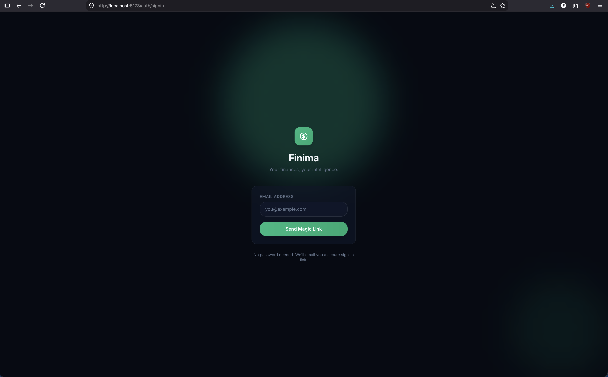
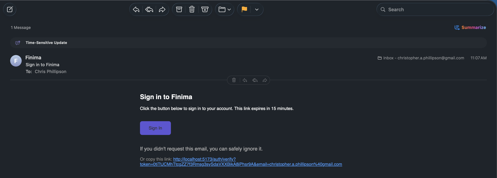
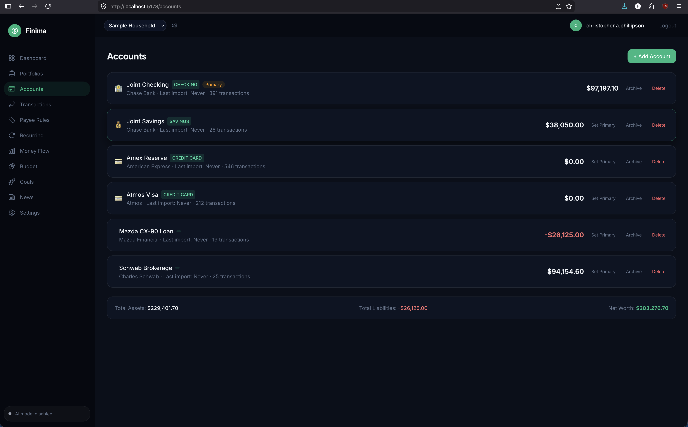
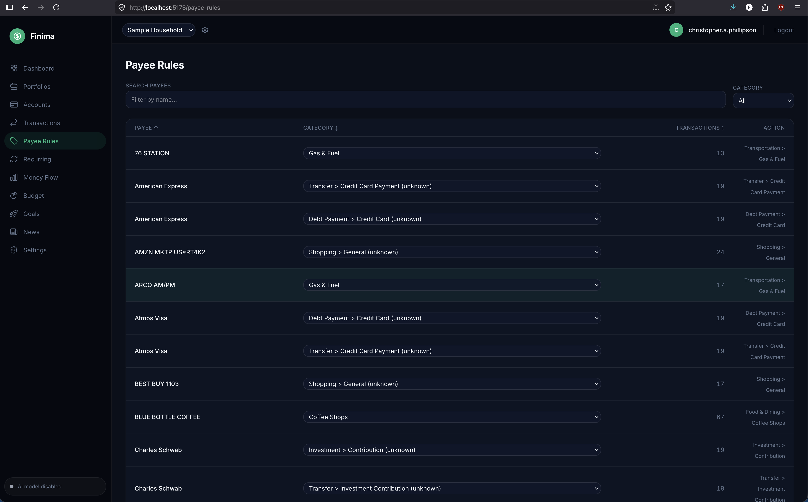
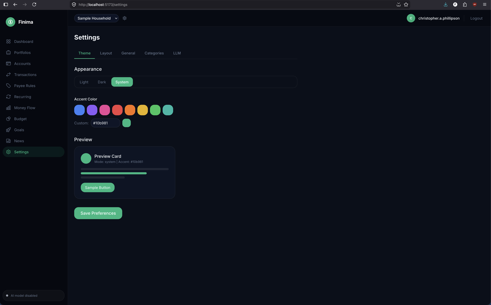

# Screenshots

A visual tour of Finima's UI. Click any thumbnail to jump to the full-size image and a short description of what that screen does.

## Gallery

<table>
  <tr>
    <td align="center" width="33%">
       
      <b>Sign in</b>
    </td>
    <td align="center" width="33%">
       
      <b>Sign in with token</b>
    </td>
    <td align="center" width="33%">
       
      <b>Dashboard</b>
    </td>
  </tr>
  <tr>
    <td align="center">
       
      <b>Portfolios</b>
    </td>
    <td align="center">
       
      <b>Accounts</b>
    </td>
    <td align="center">
       
      <b>Transactions</b>
    </td>
  </tr>
  <tr>
    <td align="center">
       
      <b>Payee rules</b>
    </td>
    <td align="center">
       
      <b>Recurring</b>
    </td>
    <td align="center">
       
      <b>Money flow</b>
    </td>
  </tr>
  <tr>
    <td align="center">
       
      <b>Budget</b>
    </td>
    <td align="center">
       
      <b>Goals</b>
    </td>
    <td align="center">
       
      <b>News</b>
    </td>
  </tr>
  <tr>
    <td align="center">
       
      <b>Settings</b>
    </td>
    <td></td>
    <td></td>
  </tr>
</table>

---

## Sign in

Finima does not use passwords. Instead, enter your email address and
Finima sends you a one-time sign-in link — click it and you are in.
No password to remember, no password to leak.

## Sign in with token

After clicking the link in your email, Finima confirms your identity
and takes you straight to the dashboard. The link works only once and
expires quickly, so if it stops working, just request a new one.

## Dashboard

Your home screen at a glance. Shows your financial health score, net
worth, monthly income versus spending, which categories you are
spending the most in, and upcoming bills. Everything is scoped to
whichever group of accounts you have selected.

## Portfolios

A portfolio is like a folder that holds a set of accounts. Most people
only ever need one — called something like "My Finances." You might
create a second one to keep personal and business money completely
separate. Deleting a portfolio also deletes all the accounts and
transactions inside it, so be sure before you do.

## Accounts

Add and manage your bank accounts, credit cards, loans, and other
financial accounts here. You can import transaction history from a
file downloaded from your bank.

## Transactions

The full list of every transaction across all your accounts. Search,
filter by date or category, correct any category that was wrongly
assigned, and export to a spreadsheet.

## Payee rules

Rules that tell Finima how to automatically label transactions from a
specific merchant or payee. You can preview exactly which existing
transactions a new rule would affect before saving it.

## Recurring

Finima automatically spots subscriptions and regular payments — like
Netflix, rent, or a gym membership — from patterns in your
transactions. Useful for finding forgotten subscriptions and seeing
what bills are coming up.

## Money flow

A visual diagram showing where your money comes from and where it
goes in a given month. Income arrives on the left, flows through your
accounts in the middle, and fans out to spending categories on the
right. Thicker lines mean more money.

## Budget

Set a monthly spending limit for each category and track how you are
doing in real time. Categories that are on pace to go over their limit
are highlighted.

## Goals

Set savings targets — like an emergency fund or a vacation — with an
amount and a target date. Finima tracks how close you are and
estimates when you will reach your goal based on how much you are
saving each month.

## News

A feed of financial news articles from sources like Investopedia and
NerdWallet. Articles are summarized by the on-device AI — nothing
about what you read is sent to any outside service.

## Settings

Change your display theme (light or dark), currency, date format, and
dashboard layout. The AI status indicator is also here so you can
check whether automatic categorization is active.
